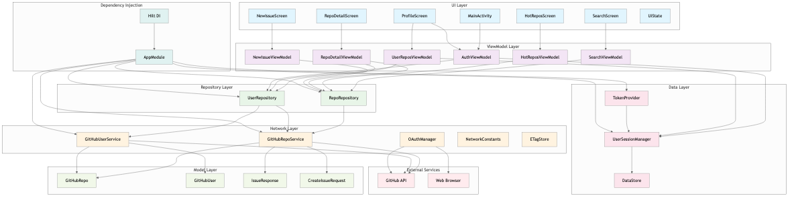
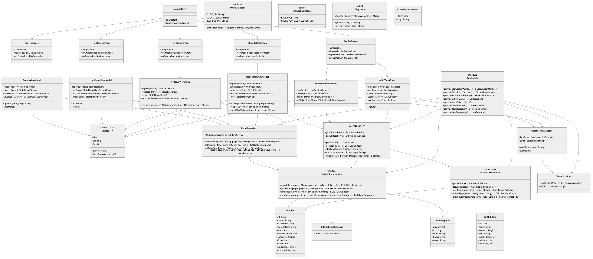
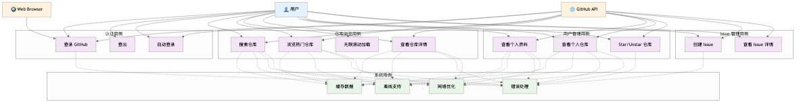

# GitHubApp - Android GitHub Client

A modern GitHub client built with Jetpack Compose and Kotlin, featuring:

- 🔍 **Repository Search** - Search repositories with infinite scroll pagination
- 🔥 **Trending Repositories** - Browse trending repos with auto-loading
- 📄 **Repository Details** - View detailed repo info with star/unstar functionality
- ⭐ **Star Management** - Star/unstar repositories (requires login)
- 🧑 **GitHub OAuth** - Secure login with custom URI scheme redirect
- 📝 **Issue Creation** - Create issues in your repositories with rich UI
- 👤 **User Profile** - View user info, stats, and repository list
- 🏗️ **Repository Pattern** - Clean architecture with data abstraction
- 🔄 **HTTP Caching** - ETag-based conditional requests and response caching
- 📱 **Infinite Scroll** - Smooth pagination with configurable prefetch thresholds
- 🎨 **Material Design 3** - Modern UI with consistent theming
- 🧪 **Comprehensive Testing** - Unit tests and UI tests
- ✅ **Robust Error Handling** - Network errors, authentication, and edge cases

## 🔧 Tech Stack

### Core Technologies
- **Jetpack Compose** - Modern declarative UI toolkit
- **Kotlin** - 100% Kotlin with coroutines and flows
- **Material Design 3** - Latest design system implementation

### Architecture & State Management
- **MVVM Architecture** - Clean separation of concerns
- **Repository Pattern** - Data abstraction layer
- **StateFlow & Flow** - Reactive state management
- **Hilt Dependency Injection** - Type-safe DI framework

### Network & Data
- **Retrofit** - Type-safe HTTP client
- **OkHttp** - HTTP client with interceptors
- **Gson** - JSON serialization
- **DataStore** - Secure token storage
- **HTTP Caching** - ETag-based conditional requests

### Testing
- **JUnit 5** - Unit testing framework
- **Mockito** - Mocking framework
- **Compose Testing** - UI testing utilities

## 📁 Project Structure

```
app/src/main/java/com/whm/githubapp/
├── 📱 MainActivity.kt              # App entry point & navigation
├── 🎨 ui/
│   ├── screens/                    # Compose UI screens
│   │   ├── SearchScreen.kt         # Repository search with infinite scroll
│   │   ├── HotReposScreen.kt       # Trending repositories
│   │   ├── ProfileScreen.kt        # User profile & repositories
│   │   ├── RepoDetailScreen.kt     # Repository details
│   │   └── NewIssueScreen.kt       # Issue creation form
│   ├── theme/                      # Material Design 3 theming
│   └── UiState.kt                  # Unified UI state management
├── 🏗️ viewmodel/                   # MVVM ViewModels
│   ├── AuthViewModel.kt            # Authentication state
│   ├── SearchViewModel.kt          # Search functionality
│   ├── HotReposViewModel.kt        # Trending repos
│   ├── UserReposViewModel.kt       # User repositories
│   ├── RepoDetailViewModel.kt      # Repository details
│   └── NewIssueViewModel.kt        # Issue creation
├── 🗄️ repository/                  # Data abstraction layer
│   ├── RepoRepository.kt           # Repository data operations
│   └── UserRepository.kt           # User data operations
├── 🌐 network/                     # Network layer
│   ├── GitHubRepoService.kt        # Repository API endpoints
│   ├── GitHubUserService.kt        # User API endpoints
│   ├── OAuthManager.kt             # OAuth flow management
│   ├── NetworkConstants.kt         # Network configuration
│   └── ETagStore.kt                # HTTP caching support
├── 📊 model/                       # Data models
│   ├── GitHubRepo.kt               # Repository data class
│   ├── GitHubUser.kt               # User data class
│   ├── IssueResponse.kt            # Issue response model
│   └── CreateIssueRequest.kt       # Issue creation model
├── 💾 datastore/                   # Local data storage
│   ├── UserSessionManager.kt       # OAuth token management
│   └── TokenProvider.kt            # Token caching & observation
└── 🔧 di/                          # Dependency injection
    └── AppModule.kt                # Hilt module configuration
```

## 🚀 Key Features

### 🔐 Authentication & Security
- **OAuth 2.0 Flow** - Secure GitHub authentication
- **Custom URI Scheme** - Seamless redirect handling (`myapp://callback`)
- **Token Management** - Secure storage with DataStore
- **Auto-login** - Persistent sessions with automatic profile navigation

### 📱 User Experience
- **Infinite Scroll** - Smooth pagination with configurable prefetch thresholds
- **HTTP Caching** - ETag-based conditional requests for better performance
- **Loading States** - Comprehensive loading, error, and empty state handling
- **Material Design 3** - Modern, consistent UI components
- **Responsive Design** - Optimized for different screen sizes

### 🏗️ Architecture Highlights
- **Repository Pattern** - Clean data abstraction layer
- **Dependency Injection** - Hilt-powered DI for testability
- **Unified State Management** - Consistent `UiState` across all screens
- **Network Optimization** - Interceptors for auth, logging, and caching
- **Error Handling** - Global 401/403 handling with automatic token clearing

## 🧪 Test Coverage

### Unit Tests
- `AuthViewModelTest` (11 tests) - Authentication flow, token management, user info loading, logout functionality, loading states, error handling
- `HotReposViewModelTest` (5 tests) - Trending repositories logic, pagination with `loadMore()`, refresh functionality, end-of-data detection, UiState management
- `NewIssueViewModelTest` (5 tests) - Issue creation functionality, form validation, UiState handling (Loading/Success/Error), repository integration
- `SearchViewModelTest` (5 tests) - Search with 300ms debouncing, pagination, infinite scroll, UiState management, error scenarios
- `UserReposViewModelTest` (7 tests) - User repository management, token validation, empty states, UiState transitions, loading states
- `RepoDetailViewModelTest` (8 tests) - Repository details loading, star/unstar functionality, star status checking, UiState management, error handling

### UI Tests
- `MainAppTest` - End-to-end navigation, tab switching, authentication states
- `SearchScreenTest` - Search input, results display, infinite scroll, error handling
- `HotReposScreenTest` - Trending repos display, loading states, navigation
- `ProfileScreenTest` - Login/logout flows, user info display, confirmation dialogs
- `RepoDetailScreenTest` - Repository details, star button, new issue navigation
- `NewIssueScreenTest` - Issue creation form, validation, success/error states

### Test Coverage Statistics
- **Unit Tests**: 6 test classes, 41 test methods
- **UI Tests**: 6 test classes, 50+ test methods
- **Coverage Areas**: ViewModels, Repositories, UI Components, Navigation, User Interactions
- **Test Scenarios**: Happy paths, error cases, edge cases, loading states, empty states, pagination, debouncing

## 🛠️ Getting Started

### Prerequisites
- Android Studio Arctic Fox or later
- JDK 17
- Android SDK 34
- GitHub OAuth App (for authentication)

### Setup
1. Clone the repository
2. Create a GitHub OAuth App:
   - Go to GitHub Settings → Developer settings → OAuth Apps
   - Set Authorization callback URL to: `myapp://callback`
   - Update `CLIENT_ID` and `CLIENT_SECRET` in `OAuthManager.kt`
3. Build and run the project

### Configuration
- **Base URL**: `https://api.github.com/` (configurable in `NetworkConstants.kt`)
- **Cache Duration**: 60 seconds (configurable)
- **Prefetch Threshold**: 5 items from bottom (configurable in ViewModels)

## 🖼️ Architecture Diagrams

### Component Diagram


### Class UML Diagram


### Use Case Diagram


## 📈 Performance Optimizations

- **HTTP Caching** - Reduces API calls with ETag-based conditional requests
- **Infinite Scroll** - Configurable prefetch thresholds for smooth UX
- **Debounced Search** - 300ms debounce to reduce API calls
- **Token Caching** - Cached token access for faster authentication
- **Lazy Loading** - Efficient list rendering with Compose LazyColumn

## 🔧 Development

### Code Style
- Follow Kotlin coding conventions
- Use meaningful variable and function names
- Add comprehensive documentation for public APIs
- Maintain consistent formatting with ktlint

### Testing Strategy
- Unit tests for ViewModels and business logic
- UI tests for critical user flows
- Mock external dependencies for isolated testing
- Test error scenarios and edge cases