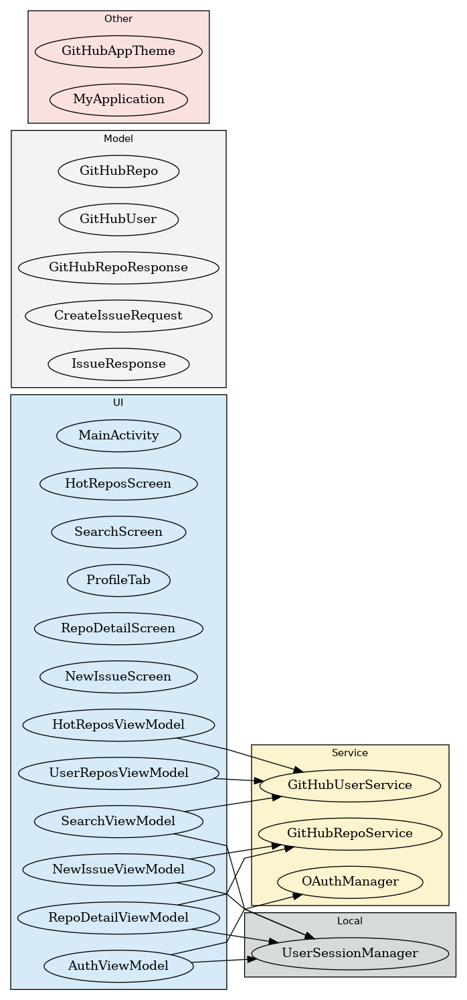

# GitHubApp - Android GitHub 客户端

一个基于 Jetpack Compose 和 Kotlin 构建的 GitHub 客户端，支持：

- 🔍 仓库搜索（关键字、语言、按 star 排序）
- 🔥 热门仓库浏览（模拟 Trending）
- 📄 仓库详情（描述、语言、star、fork、更新时间）
- ⭐ Star / Unstar 功能（需登录）
- 🧑 GitHub OAuth 登录 / 登出（保留会话）
- 📝 向自己仓库提交 Issue（含 Toast 反馈）
- 🧪 ViewModel 单元测试 / Compose UI 测试
- 🗂️ 清晰的 MVVM 架构 & 模块划分
- ✅ 支持屏幕旋转与错误处理

## 🔧 技术栈

- Jetpack Compose + Kotlin
- MVVM + StateFlow + ViewModel
- Retrofit + Gson
- DataStore 保存 token
- GitHub REST API
- 单元测试 + Mockito UI 测试

## 📁 项目结构

```
app/
├── ui/screens/              # Compose 页面
├── viewmodel/               # ViewModels
├── network/                 # Retrofit 接口
├── model/                   # 数据类
├── datastore/               # OAuth token 存储
├── MainActivity.kt          # 主入口 + Tab 路由
└── README.md                # 项目说明
```

## 🧪 测试覆盖

- `SearchViewModelTest`
- `HotReposViewModelTest`
- `RepoDetailViewModelTest`
- `NewIssueScreenTest (Compose)`

## 🖼️ 架构图

### ComponentDiagram


### UML of class


### Use Case


