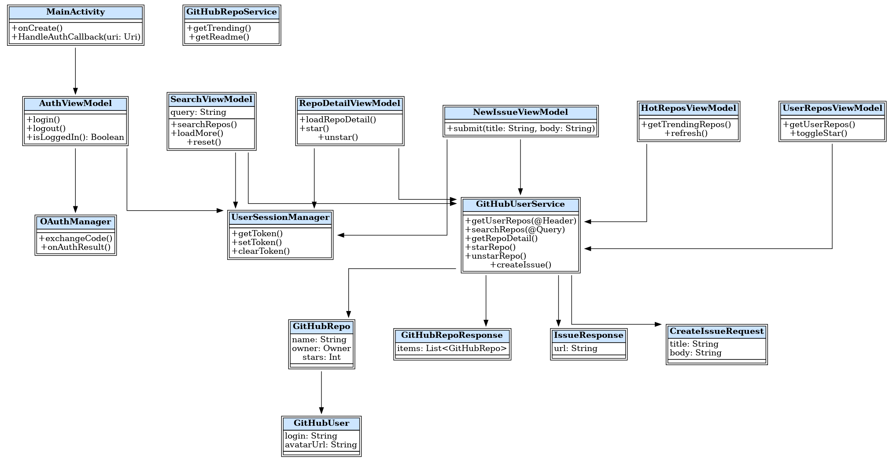

# GitHubApp - Android GitHub Client

A GitHub client built with Jetpack Compose and Kotlin, featuring:

- 🔍 Repository search (by keyword, language, sorted by stars)
- 🔥 Browse trending repositories (simulated trending feature)
- 📄 Repository detail view (description, language, stars, forks, last update)
- ⭐ Star / Unstar functionality (requires login)
- 🧑 GitHub OAuth login / logout (persistent session)
- 📝 Create issues in your own repositories (with toast feedback)
- 🧪 ViewModel unit tests / Compose UI tests
- 🗂️ Clean MVVM architecture & modular design
- ✅ Supports screen rotation and robust error handling

## 🔧 Tech Stack

- Jetpack Compose + Kotlin
- MVVM + StateFlow + ViewModel
- Retrofit + Gson
- DataStore for token storage
- GitHub REST API
- Unit testing + Mockito UI testing

## 📁 Project Structure

```
app/
├── ui/screens/              # Compose screens
├── viewmodel/               # ViewModels
├── network/                 # Retrofit interfaces
├── model/                   # Data classes
├── datastore/               # OAuth token storage
├── MainActivity.kt          # Entry + Tab navigation
└── README.md                # Project documentation
```

## 🧪 Test Coverage

- `MainAppTest`
- `HotReposViewModelTest`
- `NewIssueViewModelTest`
- `SearchViewModelTest`
- `UserReposViewModelTest`

## 🖼️ Architecture Diagrams

### Component Diagram


### Class UML Diagram


### Use Case Diagram
