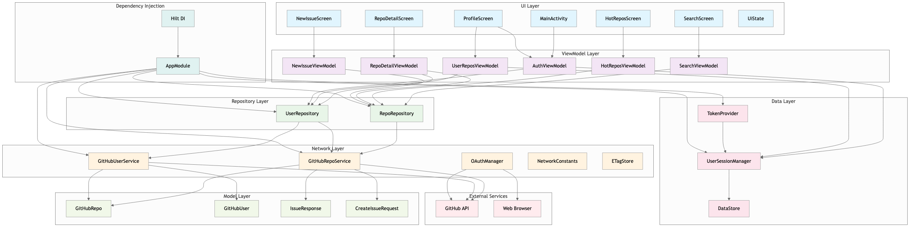
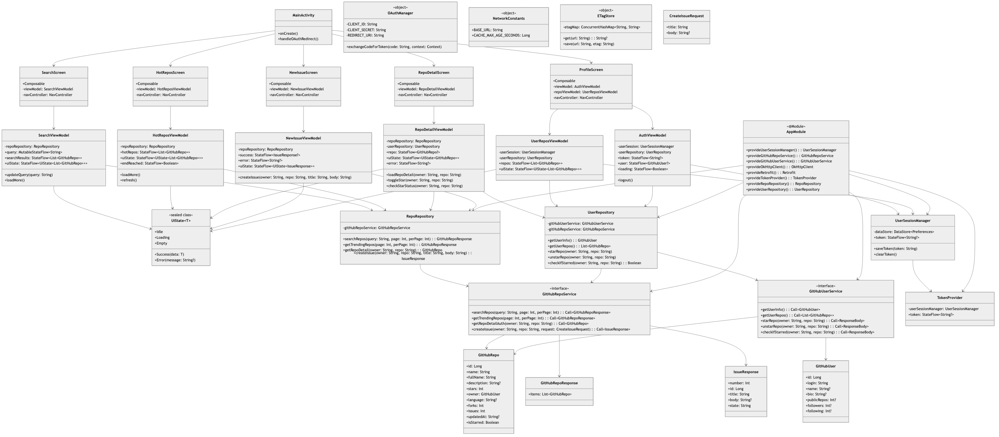

# GitHubApp - Android GitHub 客户端

一个基于 Jetpack Compose 和 Kotlin 构建的现代化 GitHub 客户端，具有以下特性：

- 🔍 **仓库搜索** - 支持无限滚动分页的仓库搜索
- 🔥 **热门仓库** - 自动加载的热门仓库浏览
- 📄 **仓库详情** - 查看详细仓库信息，支持 star/unstar 功能
- ⭐ **Star 管理** - 对仓库进行 star/unstar 操作（需要登录）
- 🧑 **GitHub OAuth** - 使用自定义 URI 方案的安全登录
- 📝 **Issue 创建** - 在您的仓库中创建 Issue，具有丰富的 UI
- 👤 **用户资料** - 查看用户信息、统计数据和仓库列表
- 🏗️ **Repository 模式** - 具有数据抽象的清晰架构
- 🔄 **HTTP 缓存** - 基于 ETag 的条件请求和响应缓存
- 📱 **无限滚动** - 可配置预取阈值的流畅分页
- 🎨 **Material Design 3** - 具有一致主题的现代 UI
- 🧪 **全面测试** - 单元测试和 UI 测试
- ✅ **健壮的错误处理** - 网络错误、认证和边界情况处理

## 🔧 技术栈

### 核心技术
- **Jetpack Compose** - 现代声明式 UI 工具包
- **Kotlin** - 100% Kotlin，使用协程和 Flow
- **Material Design 3** - 最新设计系统实现

### 架构与状态管理
- **MVVM 架构** - 关注点分离
- **Repository 模式** - 数据抽象层
- **StateFlow & Flow** - 响应式状态管理
- **Hilt 依赖注入** - 类型安全的 DI 框架

### 网络与数据
- **Retrofit** - 类型安全的 HTTP 客户端
- **OkHttp** - 带拦截器的 HTTP 客户端
- **Gson** - JSON 序列化
- **DataStore** - 安全的 token 存储
- **HTTP 缓存** - 基于 ETag 的条件请求

### 测试
- **JUnit 5** - 单元测试框架
- **Mockito** - 模拟框架
- **Compose 测试** - UI 测试工具

## 📁 项目结构

```
app/src/main/java/com/whm/githubapp/
├── 📱 MainActivity.kt              # 应用入口点 & 导航
├── 🎨 ui/
│   ├── screens/                    # Compose UI 页面
│   │   ├── SearchScreen.kt         # 带无限滚动的仓库搜索
│   │   ├── HotReposScreen.kt       # 热门仓库
│   │   ├── ProfileScreen.kt        # 用户资料 & 仓库列表
│   │   ├── RepoDetailScreen.kt     # 仓库详情
│   │   └── NewIssueScreen.kt       # Issue 创建表单
│   ├── theme/                      # Material Design 3 主题
│   └── UiState.kt                  # 统一 UI 状态管理
├── 🏗️ viewmodel/                   # MVVM ViewModels
│   ├── AuthViewModel.kt            # 认证状态
│   ├── SearchViewModel.kt          # 搜索功能
│   ├── HotReposViewModel.kt        # 热门仓库
│   ├── UserReposViewModel.kt       # 用户仓库
│   ├── RepoDetailViewModel.kt      # 仓库详情
│   └── NewIssueViewModel.kt        # Issue 创建
├── 🗄️ repository/                  # 数据抽象层
│   ├── RepoRepository.kt           # 仓库数据操作
│   └── UserRepository.kt           # 用户数据操作
├── 🌐 network/                     # 网络层
│   ├── GitHubRepoService.kt        # 仓库 API 端点
│   ├── GitHubUserService.kt        # 用户 API 端点
│   ├── OAuthManager.kt             # OAuth 流程管理
│   ├── NetworkConstants.kt         # 网络配置
│   └── ETagStore.kt                # HTTP 缓存支持
├── 📊 model/                       # 数据模型
│   ├── GitHubRepo.kt               # 仓库数据类
│   ├── GitHubUser.kt               # 用户数据类
│   ├── IssueResponse.kt            # Issue 响应模型
│   └── CreateIssueRequest.kt       # Issue 创建模型
├── 💾 datastore/                   # 本地数据存储
│   ├── UserSessionManager.kt       # OAuth token 管理
│   └── TokenProvider.kt            # Token 缓存 & 观察
└── 🔧 di/                          # 依赖注入
    └── AppModule.kt                # Hilt 模块配置
```

## 🚀 核心特性

### 🔐 认证与安全
- **OAuth 2.0 流程** - 安全的 GitHub 认证
- **自定义 URI 方案** - 无缝重定向处理 (`myapp://callback`)
- **Token 管理** - 使用 DataStore 安全存储
- **自动登录** - 持久会话，自动跳转到资料页面

### 📱 用户体验
- **无限滚动** - 可配置预取阈值的流畅分页
- **HTTP 缓存** - 基于 ETag 的条件请求，提升性能
- **加载状态** - 全面的加载、错误和空状态处理
- **Material Design 3** - 现代、一致的 UI 组件
- **响应式设计** - 针对不同屏幕尺寸优化

### 🏗️ 架构亮点
- **Repository 模式** - 清晰的数据抽象层
- **依赖注入** - Hilt 驱动的 DI，提高可测试性
- **统一状态管理** - 所有页面一致的 `UiState`
- **网络优化** - 认证、日志和缓存拦截器
- **错误处理** - 全局 401/403 处理，自动清除 token

## 🧪 测试覆盖

### 单元测试
- `AuthViewModelTest` - 认证流程测试
- `HotReposViewModelTest` - 热门仓库逻辑
- `NewIssueViewModelTest` - Issue 创建功能
- `SearchViewModelTest` - 带防抖和分页的搜索
- `UserReposViewModelTest` - 用户仓库管理

### UI 测试
- `MainAppTest` - 端到端导航和用户流程

## 🛠️ 快速开始

### 前置条件
- Android Studio Arctic Fox 或更高版本
- JDK 17
- Android SDK 34
- GitHub OAuth 应用（用于认证）

### 设置步骤
1. 克隆仓库
2. 创建 GitHub OAuth 应用：
   - 前往 GitHub 设置 → 开发者设置 → OAuth 应用
   - 设置授权回调 URL 为：`myapp://callback`
   - 更新 `OAuthManager.kt` 中的 `CLIENT_ID` 和 `CLIENT_SECRET`
3. 构建并运行项目

### 配置
- **基础 URL**：`https://api.github.com/`（可在 `NetworkConstants.kt` 中配置）
- **缓存时长**：60 秒（可配置）
- **预取阈值**：距离底部 5 项（可在 ViewModels 中配置）

## 🖼️ 架构图

### 组件图


### 类 UML 图


### 用例图


## 📈 性能优化

- **HTTP 缓存** - 通过基于 ETag 的条件请求减少 API 调用
- **无限滚动** - 可配置的预取阈值，提供流畅的用户体验
- **防抖搜索** - 300ms 防抖，减少 API 调用
- **Token 缓存** - 缓存 token 访问，加快认证速度
- **懒加载** - 使用 Compose LazyColumn 高效渲染列表

## 🔧 开发

### 代码风格
- 遵循 Kotlin 编码规范
- 使用有意义的变量和函数名
- 为公共 API 添加全面的文档
- 使用 ktlint 保持一致的格式

### 测试策略
- ViewModels 和业务逻辑的单元测试
- 关键用户流程的 UI 测试
- 模拟外部依赖以进行隔离测试
- 测试错误场景和边界情况

