# GitHubApp - 组件架构图

```mermaid
graph TB
    %% UI Layer
    subgraph "UI Layer"
        MA[MainActivity]
        SS[SearchScreen]
        HRS[HotReposScreen]
        PS[ProfileScreen]
        RDS[RepoDetailScreen]
        NIS[NewIssueScreen]
        UST[UiState]
    end

    %% ViewModel Layer
    subgraph "ViewModel Layer"
        AVM[AuthViewModel]
        SVM[SearchViewModel]
        HRVM[HotReposViewModel]
        URVM[UserReposViewModel]
        RDVM[RepoDetailViewModel]
        NIVM[NewIssueViewModel]
    end

    %% Repository Layer
    subgraph "Repository Layer"
        RR[RepoRepository]
        UR[UserRepository]
    end

    %% Network Layer
    subgraph "Network Layer"
        GRS[GitHubRepoService]
        GUS[GitHubUserService]
        OAM[OAuthManager]
        NC[NetworkConstants]
        ES[ETagStore]
    end

    %% Data Layer
    subgraph "Data Layer"
        USM[UserSessionManager]
        TP[TokenProvider]
        DS[DataStore]
    end

    %% Model Layer
    subgraph "Model Layer"
        GR[GitHubRepo]
        GU[GitHubUser]
        IR[IssueResponse]
        CIR[CreateIssueRequest]
    end

    %% Dependency Injection
    subgraph "Dependency Injection"
        AM[AppModule]
        Hilt[Hilt DI]
    end

    %% External Services
    subgraph "External Services"
        GitHub[GitHub API]
        Browser[Web Browser]
    end

    %% UI to ViewModel connections
    MA --> AVM
    SS --> SVM
    HRS --> HRVM
    PS --> AVM
    PS --> URVM
    RDS --> RDVM
    NIS --> NIVM

    %% ViewModel to Repository connections
    SVM --> RR
    HRVM --> RR
    RDVM --> RR
    RDVM --> UR
    NIVM --> RR
    URVM --> UR
    AVM --> UR

    %% Repository to Network connections
    RR --> GRS
    UR --> GUS
    UR --> GRS

    %% Network to External connections
    GRS --> GitHub
    GUS --> GitHub
    OAM --> GitHub
    OAM --> Browser

    %% Data flow connections
    AVM --> USM
    URVM --> USM
    USM --> DS
    TP --> USM
    AM --> TP

    %% Model usage
    GRS --> GR
    GUS --> GU
    GUS --> GR
    GRS --> IR
    GRS --> CIR

    %% DI connections
    AM --> GRS
    AM --> GUS
    AM --> USM
    AM --> RR
    AM --> UR
    Hilt --> AM

    %% Styling
    classDef uiLayer fill:#e1f5fe
    classDef viewModelLayer fill:#f3e5f5
    classDef repositoryLayer fill:#e8f5e8
    classDef networkLayer fill:#fff3e0
    classDef dataLayer fill:#fce4ec
    classDef modelLayer fill:#f1f8e9
    classDef diLayer fill:#e0f2f1
    classDef externalLayer fill:#ffebee

    class MA,SS,HRS,PS,RDS,NIS,UST uiLayer
    class AVM,SVM,HRVM,URVM,RDVM,NIVM viewModelLayer
    class RR,UR repositoryLayer
    class GRS,GUS,OAM,NC,ES networkLayer
    class USM,TP,DS dataLayer
    class GR,GU,IR,CIR modelLayer
    class AM,Hilt diLayer
    class GitHub,Browser externalLayer
```

## 架构说明

### 层次结构
1. **UI Layer**: Jetpack Compose 界面层
2. **ViewModel Layer**: MVVM 架构的视图模型层
3. **Repository Layer**: 数据抽象层
4. **Network Layer**: 网络请求层
5. **Data Layer**: 本地数据存储层
6. **Model Layer**: 数据模型层
7. **Dependency Injection**: 依赖注入层

### 关键特性
- **Repository 模式**: 数据抽象和缓存
- **MVVM 架构**: 清晰的关注点分离
- **依赖注入**: Hilt 管理的依赖关系
- **统一状态管理**: UiState 统一处理
- **网络优化**: 拦截器和缓存机制
