# GitHubApp - 类 UML 图

```mermaid
classDiagram
    %% UI Layer Classes
    class MainActivity {
        +onCreate()
        +handleOAuthRedirect()
    }

    class SearchScreen {
        +Composable
        -viewModel: SearchViewModel
        -navController: NavController
    }

    class HotReposScreen {
        +Composable
        -viewModel: HotReposViewModel
        -navController: NavController
    }

    class ProfileScreen {
        +Composable
        -viewModel: AuthViewModel
        -repoViewModel: UserReposViewModel
        -navController: NavController
    }

    class RepoDetailScreen {
        +Composable
        -viewModel: RepoDetailViewModel
        -navController: NavController
    }

    class NewIssueScreen {
        +Composable
        -viewModel: NewIssueViewModel
        -navController: NavController
    }

    class UiState~T~ {
        <<sealed class>>
        +Idle
        +Loading
        +Success(data: T)
        +Error(message: String?)
        +Empty
    }

    %% ViewModel Layer Classes
    class AuthViewModel {
        -userSession: UserSessionManager
        -userRepository: UserRepository
        +token: StateFlow~String?~
        +user: StateFlow~GitHubUser?~
        +loading: StateFlow~Boolean~
        +logout()
    }

    class SearchViewModel {
        -repoRepository: RepoRepository
        +query: MutableStateFlow~String~
        +searchResults: StateFlow~List~GitHubRepo~~
        +uiState: StateFlow~UiState~List~GitHubRepo~~~
        +updateQuery(query: String)
        +loadMore()
    }

    class HotReposViewModel {
        -repoRepository: RepoRepository
        +hotRepos: StateFlow~List~GitHubRepo~~
        +uiState: StateFlow~UiState~List~GitHubRepo~~~
        +endReached: StateFlow~Boolean~
        +loadMore()
        +refresh()
    }

    class UserReposViewModel {
        -userSession: UserSessionManager
        -userRepository: UserRepository
        +repos: StateFlow~List~GitHubRepo~~
        +uiState: StateFlow~UiState~List~GitHubRepo~~~
    }

    class RepoDetailViewModel {
        -repoRepository: RepoRepository
        -userRepository: UserRepository
        +repo: StateFlow~GitHubRepo?~
        +uiState: StateFlow~UiState~GitHubRepo~~
        +error: StateFlow~String?~
        +loadRepoDetail(owner: String, repo: String)
        +toggleStar(owner: String, repo: String)
        +checkStarStatus(owner: String, repo: String)
    }

    class NewIssueViewModel {
        -repoRepository: RepoRepository
        +success: StateFlow~IssueResponse?~
        +error: StateFlow~String?~
        +uiState: StateFlow~UiState~IssueResponse~~
        +createIssue(owner: String, repo: String, title: String, body: String)
    }

    %% Repository Layer Classes
    class RepoRepository {
        -gitHubRepoService: GitHubRepoService
        +searchRepos(query: String, page: Int, perPage: Int): GitHubRepoResponse
        +getTrendingRepos(page: Int, perPage: Int): GitHubRepoResponse
        +getRepoDetail(owner: String, repo: String): GitHubRepo
        +createIssue(owner: String, repo: String, title: String, body: String): IssueResponse
    }

    class UserRepository {
        -gitHubUserService: GitHubUserService
        -gitHubRepoService: GitHubRepoService
        +getUserInfo(): GitHubUser
        +getUserRepos(): List~GitHubRepo~
        +starRepo(owner: String, repo: String)
        +unstarRepo(owner: String, repo: String)
        +checkIfStarred(owner: String, repo: String): Boolean
    }

    %% Network Layer Classes
    class GitHubRepoService {
        <<interface>>
        +searchRepos(query: String, page: Int, perPage: Int): Call~GitHubRepoResponse~
        +getTrendingRepos(page: Int, perPage: Int): Call~GitHubRepoResponse~
        +getRepoDetailAuth(owner: String, repo: String): Call~GitHubRepo~
        +createIssue(owner: String, repo: String, request: CreateIssueRequest): Call~IssueResponse~
    }

    class GitHubUserService {
        <<interface>>
        +getUserInfo(): Call~GitHubUser~
        +getUserRepos(): Call~List~GitHubRepo~~
        +starRepo(owner: String, repo: String): Call~ResponseBody~
        +unstarRepo(owner: String, repo: String): Call~ResponseBody~
        +checkIfStarred(owner: String, repo: String): Call~ResponseBody~
    }

    class OAuthManager {
        <<object>>
        -CLIENT_ID: String
        -CLIENT_SECRET: String
        -REDIRECT_URI: String
        +exchangeCodeForToken(code: String, context: Context)
    }

    class NetworkConstants {
        <<object>>
        +BASE_URL: String
        +CACHE_MAX_AGE_SECONDS: Long
    }

    class ETagStore {
        <<object>>
        -etagMap: ConcurrentHashMap~String, String~
        +get(url: String): String?
        +save(url: String, etag: String)
    }

    %% Data Layer Classes
    class UserSessionManager {
        -dataStore: DataStore~Preferences~
        +token: StateFlow~String?~
        +saveToken(token: String)
        +clearToken()
    }

    class TokenProvider {
        -userSessionManager: UserSessionManager
        +token: StateFlow~String?~
    }

    %% Model Classes
    class GitHubRepo {
        +id: Long
        +name: String
        +fullName: String
        +description: String?
        +stars: Int
        +owner: GitHubUser
        +language: String?
        +forks: Int
        +issues: Int
        +updatedAt: String?
        +isStarred: Boolean
    }

    class GitHubUser {
        +id: Long
        +login: String
        +name: String?
        +bio: String?
        +publicRepos: Int?
        +followers: Int?
        +following: Int?
    }

    class IssueResponse {
        +number: Int
        +id: Long
        +title: String
        +body: String?
        +state: String
    }

    class CreateIssueRequest {
        +title: String
        +body: String?
    }

    class GitHubRepoResponse {
        +items: List~GitHubRepo~
    }

    %% Dependency Injection
    class AppModule {
        <<@Module>>
        +provideUserSessionManager(): UserSessionManager
        +provideGitHubRepoService(): GitHubRepoService
        +provideGitHubUserService(): GitHubUserService
        +provideOkHttpClient(): OkHttpClient
        +provideRetrofit(): Retrofit
        +provideTokenProvider(): TokenProvider
        +provideRepoRepository(): RepoRepository
        +provideUserRepository(): UserRepository
    }

    %% Relationships
    MainActivity --> SearchScreen
    MainActivity --> HotReposScreen
    MainActivity --> ProfileScreen
    MainActivity --> RepoDetailScreen
    MainActivity --> NewIssueScreen

    SearchScreen --> SearchViewModel
    HotReposScreen --> HotReposViewModel
    ProfileScreen --> AuthViewModel
    ProfileScreen --> UserReposViewModel
    RepoDetailScreen --> RepoDetailViewModel
    NewIssueScreen --> NewIssueViewModel

    SearchViewModel --> RepoRepository
    HotReposViewModel --> RepoRepository
    RepoDetailViewModel --> RepoRepository
    RepoDetailViewModel --> UserRepository
    NewIssueViewModel --> RepoRepository
    UserReposViewModel --> UserRepository
    AuthViewModel --> UserRepository

    RepoRepository --> GitHubRepoService
    UserRepository --> GitHubUserService
    UserRepository --> GitHubRepoService

    AuthViewModel --> UserSessionManager
    UserReposViewModel --> UserSessionManager
    UserSessionManager --> TokenProvider

    GitHubRepoService --> GitHubRepo
    GitHubRepoService --> GitHubRepoResponse
    GitHubRepoService --> IssueResponse
    GitHubUserService --> GitHubUser
    GitHubUserService --> GitHubRepo

    AppModule --> UserSessionManager
    AppModule --> GitHubRepoService
    AppModule --> GitHubUserService
    AppModule --> TokenProvider
    AppModule --> RepoRepository
    AppModule --> UserRepository

    SearchViewModel --> UiState
    HotReposViewModel --> UiState
    RepoDetailViewModel --> UiState
    NewIssueViewModel --> UiState
    UserReposViewModel --> UiState
```

## 类关系说明

### 继承关系
- 所有 ViewModel 继承自 `ViewModel`
- 所有 Screen 都是 `@Composable` 函数

### 依赖关系
- ViewModels 依赖 Repositories
- Repositories 依赖 Services
- Services 使用 Models
- AppModule 提供所有依赖

### 组合关系
- UiState 是泛型密封类，被多个 ViewModel 使用
- GitHubRepo 包含 GitHubUser 作为 owner

### 关联关系
- MainActivity 管理所有 Screen 的导航
- UserSessionManager 管理认证状态
- TokenProvider 提供缓存的 token 访问
