# GitHubApp - 用例图

```mermaid
graph TB
    %% Actors
    User[👤 用户]
    GitHub[🌐 GitHub API]
    Browser[🌍 Web Browser]

    %% Use Cases
    subgraph "认证用例"
        UC1[登录 GitHub]
        UC2[登出]
        UC3[自动登录]
    end

    subgraph "仓库浏览用例"
        UC4[搜索仓库]
        UC5[浏览热门仓库]
        UC6[查看仓库详情]
        UC7[无限滚动加载]
    end

    subgraph "用户管理用例"
        UC8[查看个人资料]
        UC9[查看个人仓库]
        UC10[Star/Unstar 仓库]
    end

    subgraph "Issue 管理用例"
        UC11[创建 Issue]
        UC12[查看 Issue 详情]
    end

    subgraph "系统用例"
        UC13[缓存数据]
        UC14[离线支持]
        UC15[错误处理]
        UC16[网络优化]
    end

    %% User to Use Cases
    User --> UC1
    User --> UC2
    User --> UC3
    User --> UC4
    User --> UC5
    User --> UC6
    User --> UC7
    User --> UC8
    User --> UC9
    User --> UC10
    User --> UC11
    User --> UC12

    %% External Systems to Use Cases
    GitHub --> UC1
    GitHub --> UC3
    GitHub --> UC4
    GitHub --> UC5
    GitHub --> UC6
    GitHub --> UC8
    GitHub --> UC9
    GitHub --> UC10
    GitHub --> UC11
    GitHub --> UC12

    Browser --> UC1

    %% System Use Cases (automatic)
    UC4 -.-> UC13
    UC5 -.-> UC13
    UC6 -.-> UC13
    UC8 -.-> UC13
    UC9 -.-> UC13

    UC4 -.-> UC14
    UC5 -.-> UC14
    UC6 -.-> UC14
    UC8 -.-> UC14
    UC9 -.-> UC14

    UC1 -.-> UC15
    UC4 -.-> UC15
    UC5 -.-> UC15
    UC6 -.-> UC15
    UC8 -.-> UC15
    UC9 -.-> UC15
    UC10 -.-> UC15
    UC11 -.-> UC15

    UC4 -.-> UC16
    UC5 -.-> UC16
    UC6 -.-> UC16
    UC8 -.-> UC16
    UC9 -.-> UC16

    %% Styling
    classDef actor fill:#e3f2fd
    classDef useCase fill:#f3e5f5
    classDef systemUseCase fill:#e8f5e8
    classDef externalSystem fill:#fff3e0

    class User actor
    class UC1,UC2,UC3,UC4,UC5,UC6,UC7,UC8,UC9,UC10,UC11,UC12 useCase
    class UC13,UC14,UC15,UC16 systemUseCase
    class GitHub,Browser externalSystem
```

## 用例详细说明

### 🔐 认证用例

#### UC1: 登录 GitHub
- **主要参与者**: 用户
- **前置条件**: 用户未登录
- **主要流程**:
  1. 用户点击登录按钮
  2. 系统打开 GitHub 授权页面
  3. 用户在 GitHub 上授权
  4. GitHub 重定向到应用
  5. 系统获取访问令牌
  6. 系统保存令牌并获取用户信息
  7. 用户登录成功，自动跳转到个人资料页面

#### UC2: 登出
- **主要参与者**: 用户
- **前置条件**: 用户已登录
- **主要流程**:
  1. 用户点击登出按钮
  2. 系统显示确认对话框
  3. 用户确认登出
  4. 系统清除本地令牌
  5. 用户登出成功

#### UC3: 自动登录
- **主要参与者**: 系统
- **前置条件**: 用户之前已登录
- **主要流程**:
  1. 应用启动时检查本地令牌
  2. 如果令牌存在，自动获取用户信息
  3. 用户自动登录成功

### 🔍 仓库浏览用例

#### UC4: 搜索仓库
- **主要参与者**: 用户
- **前置条件**: 无
- **主要流程**:
  1. 用户输入搜索关键词
  2. 系统防抖处理（300ms）
  3. 系统调用 GitHub API 搜索
  4. 系统显示搜索结果
  5. 用户可滚动加载更多结果

#### UC5: 浏览热门仓库
- **主要参与者**: 用户
- **前置条件**: 无
- **主要流程**:
  1. 用户进入热门仓库页面
  2. 系统加载热门仓库列表
  3. 用户可滚动浏览
  4. 系统自动加载更多内容

#### UC6: 查看仓库详情
- **主要参与者**: 用户
- **前置条件**: 无
- **主要流程**:
  1. 用户点击仓库项
  2. 系统显示仓库详细信息
  3. 如果用户已登录，显示 Star 状态
  4. 用户可进行 Star/Unstar 操作

#### UC7: 无限滚动加载
- **主要参与者**: 系统
- **前置条件**: 用户正在浏览列表
- **主要流程**:
  1. 用户滚动到接近底部
  2. 系统检测到预取阈值
  3. 系统自动加载下一页数据
  4. 新数据追加到现有列表

### 👤 用户管理用例

#### UC8: 查看个人资料
- **主要参与者**: 用户
- **前置条件**: 用户已登录
- **主要流程**:
  1. 用户进入个人资料页面
  2. 系统显示用户基本信息
  3. 系统显示用户统计数据
  4. 系统显示用户仓库列表

#### UC9: 查看个人仓库
- **主要参与者**: 用户
- **前置条件**: 用户已登录
- **主要流程**:
  1. 系统加载用户仓库列表
  2. 系统显示仓库详细信息
  3. 用户可点击查看仓库详情
  4. 用户可创建新 Issue

#### UC10: Star/Unstar 仓库
- **主要参与者**: 用户
- **前置条件**: 用户已登录
- **主要流程**:
  1. 用户在仓库详情页面点击 Star 按钮
  2. 系统调用 GitHub API
  3. 系统更新 Star 状态
  4. 用户操作成功

### 📝 Issue 管理用例

#### UC11: 创建 Issue
- **主要参与者**: 用户
- **前置条件**: 用户已登录，且拥有仓库权限
- **主要流程**:
  1. 用户点击"New Issue"按钮
  2. 系统显示 Issue 创建表单
  3. 用户填写标题和描述
  4. 用户提交 Issue
  5. 系统创建 Issue 并显示成功信息

#### UC12: 查看 Issue 详情
- **主要参与者**: 用户
- **前置条件**: 无
- **主要流程**:
  1. 用户点击 Issue 链接
  2. 系统在浏览器中打开 Issue 详情
  3. 用户可查看 Issue 完整信息

### 🔧 系统用例

#### UC13: 缓存数据
- **主要参与者**: 系统
- **描述**: 自动缓存 API 响应数据，提高性能

#### UC14: 离线支持
- **主要参与者**: 系统
- **描述**: 在网络不可用时显示缓存数据

#### UC15: 错误处理
- **主要参与者**: 系统
- **描述**: 处理网络错误、认证错误等异常情况

#### UC16: 网络优化
- **主要参与者**: 系统
- **描述**: 使用 ETag、拦截器等优化网络请求
